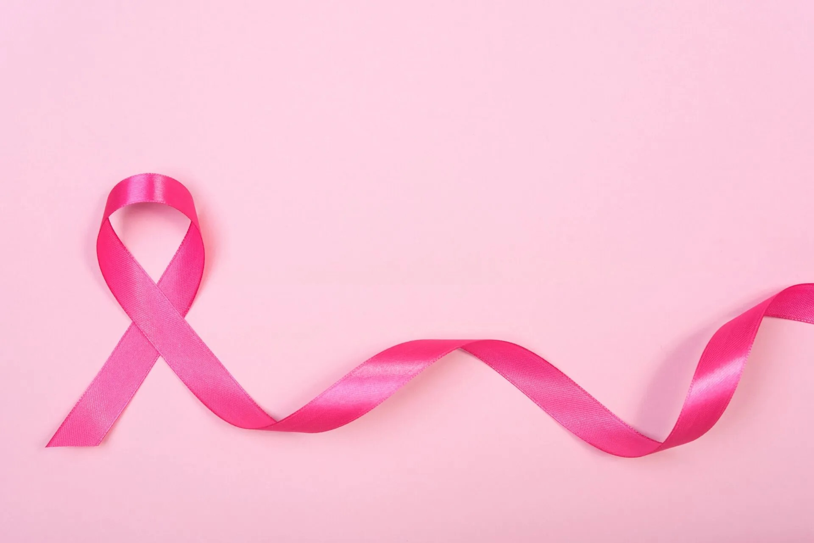
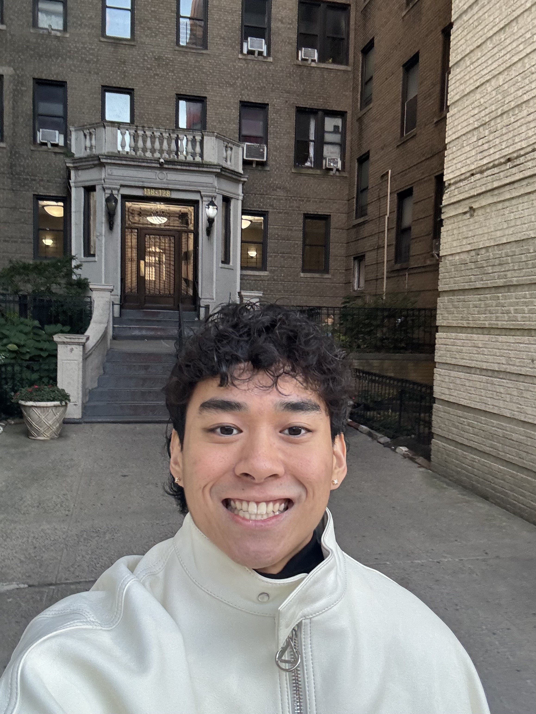
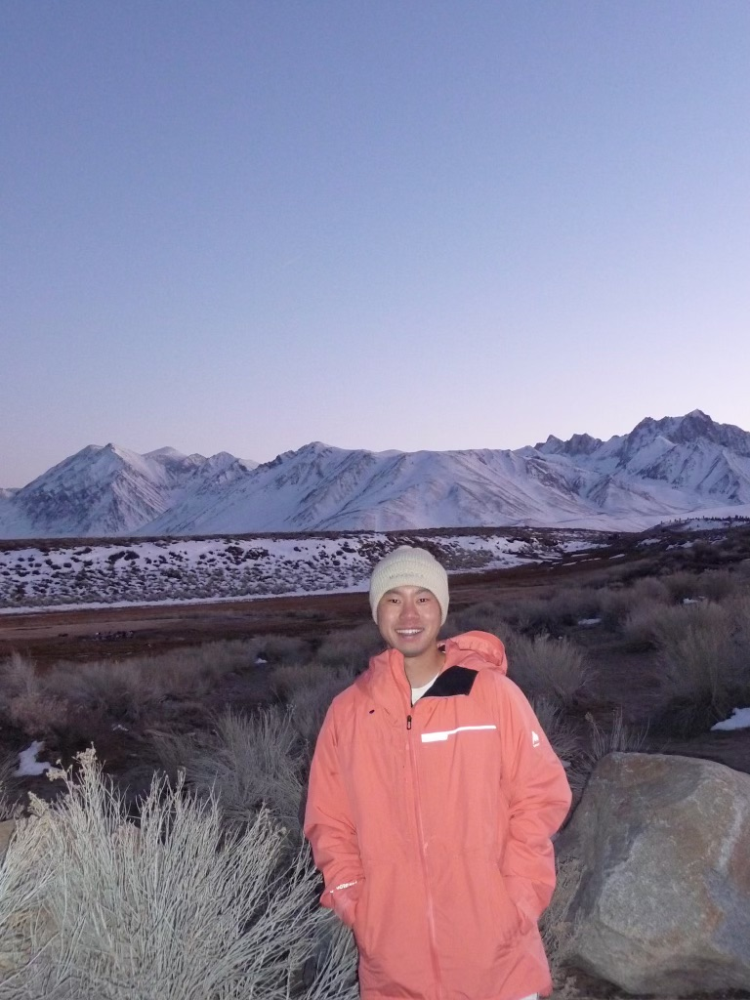
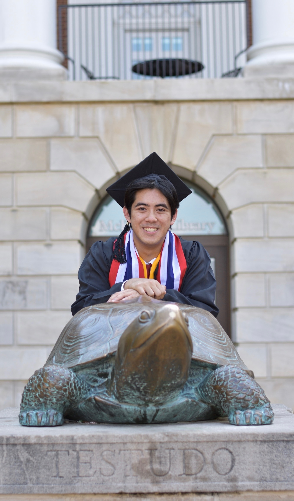

## Who We Are

We are a team of four students — **Heather**, **Clement**, **Eric**, and **Veep** — who worked together on this project. We come from different backgrounds but share an interest in data, problem-solving, and clear communication.

  
**Heather**

Linkedin: https://www.linkedin.com/in/heatherlu2001/

Github: https://github.com/heather-lu

  
**Clement**

Linkedin: https://www.linkedin.com/in/clement-li-881696a4/

Github: https://github.com/clementiaboo

  
**Eric**

Linkedin: https://www.linkedin.com/in/eric-zhang-26a5aa221/

Github: https://github.com/xz3312

  
**Veep**

Linkedin: https://www.linkedin.com/in/vpetchger/

Github: https://github.com/vp2587

